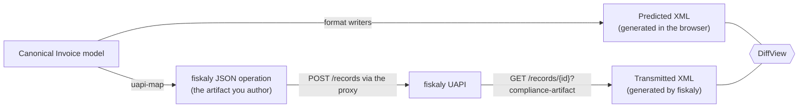
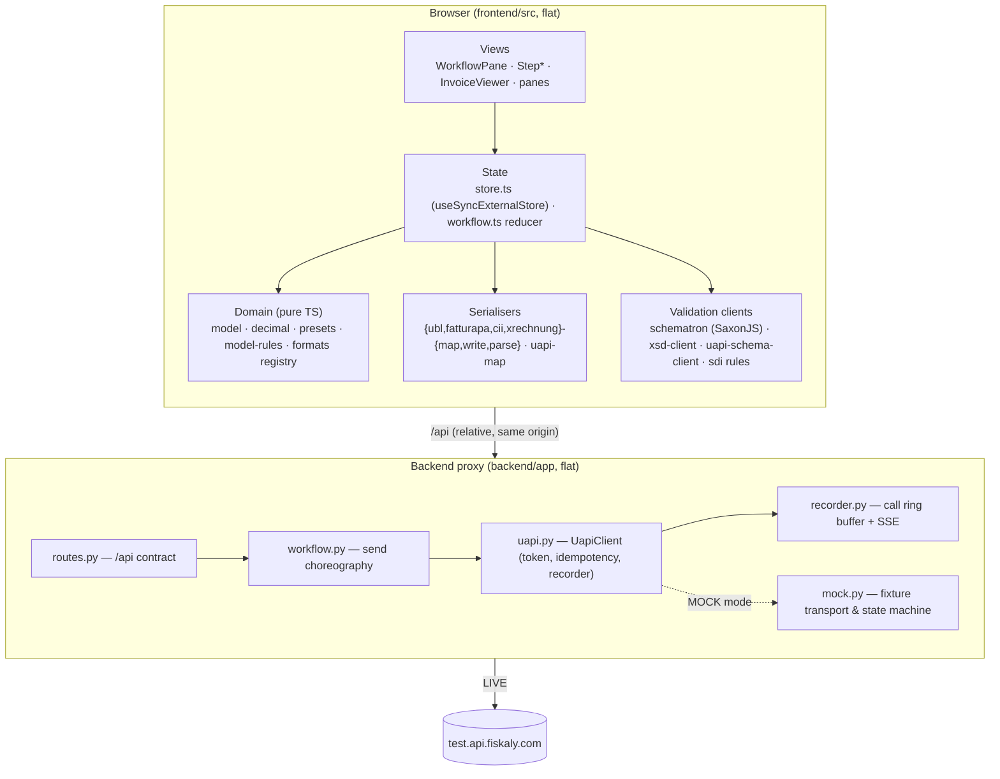

# 01 — Overview & layers

## What this app is

A browser tool that walks an e-invoice through **create → validate → send** against the fiskaly
Unified API (UAPI), built for two audiences at once: a **demo** (what does e-invoicing through
fiskaly look like?) and a **test harness** (what exactly does the API accept, and what does it do
with what I send?).

The legal backdrop: EU Directive 2014/55/EU made EN 16931 the semantic core of European
e-invoicing; Italy mandates FatturaPA through SDI (D.Lgs. 127/2015), Belgium mandates Peppol BIS
Billing 3.0 for B2B from 2026, Germany's B2G runs on XRechnung. The UAPI abstracts these behind one
JSON operation — and this app makes that abstraction _inspectable_.

## The dual-track idea

The UAPI does not accept XML. You post a structured JSON `TRANSACTION::INVOICE`; fiskaly generates
the country-specific XML server-side (GOBL → Invopop → SDI/Peppol) and transmits it. That creates
the question the whole app is built around: **what will the transmitted document actually look
like?**

The app answers it twice and diffs the answers:

- The **client-side lab** track: the canonical model is serialised by this repo's own writers into
  the XML the user _expects_ (FatturaPA, UBL, XRechnung or CII), and validated locally through the
  full pipeline ([06](06-validation.md)).
- The **harness** track: the same model is mapped to the JSON operation, posted through the backend
  proxy, followed through its lifecycle, and the XML fiskaly _actually_ transmitted is fetched back
  as the compliance artifact.

**The diff is the demo moment** (ADR-0001): it shows precisely where the local prediction and
fiskaly's generation agree and where they don't. In MOCK mode the right-hand side is a fixture, so
the diff carries a caveat ([09](09-limitations.md#the-mock-diff-caveat)).

## The layers

Boundaries that matter:

- **The domain layer is pure TypeScript** — no React, no fetch. `model.ts`, `decimal.ts`,
  `presets.ts`, `model-rules.ts` and every mapping table can run in Node (the gap-report and
  handbook generators do exactly that).
- **The browser never holds credentials.** Every fiskaly call goes through the proxy; the proxy
  injects `Authorization`, `X-Api-Version` and `X-Idempotency-Key`, records the call (masked), and
  streams it to the API-log pane over SSE. Secrets live in `.env` (bootstrap) or in
  `backend/.uapi-settings.json`, a persisted store the Settings dialog writes to (ADR-0005,
  ADR-0009).
- **Live and mock share one code path.** MOCK mode swaps an `httpx.MockTransport` into the same
  `UapiClient`; nothing above the transport branches on the mode ([07](07-send-and-backend.md#the-mock)).
- **The spec is fetched at build time** and is the API authority: types are generated from it, the
  contract validator compiles it, the field catalogue walks it ([08](08-infrastructure.md)).

## The workflow

Four steps, one invoice: **Setup** (pick a preset scenario) → **Mapper** (edit the invoice across
three synchronized panes: form fields, fiskaly JSON, predicted XML) → **Validate** (run the local
pipeline) → **Send** (post through fiskaly, follow the lifecycle, diff the artifact). A second
top-level section, the **Test runner**, replays the published fiskaly Postman collections through
the same proxy. There is one account, not a seller/buyer pair (ADR-0009).

Work persists across reloads (invoice edits, send record ids, the correction target) in
`localStorage` — never tokens or credentials.

## Repo layout

| Path                   | Holds                                                                                            |
| ---------------------- | ------------------------------------------------------------------------------------------------ |
| `frontend/`            | React 19 + TypeScript + Vite SPA, flat `src/` — one file per concern                             |
| `backend/`             | FastAPI proxy, flat `app/` — one file per concern                                                |
| `spec/`                | The UAPI OpenAPI specs + Postman collections (committed cache; `spec.json` names the active one) |
| `vendor/`              | Standards artifacts (XSDs, Schematron) — git-ignored, fetched sha256-pinned by `make schemas`    |
| `frontend/public/sef/` | Compiled Schematron (SEF) — git-ignored, built by `make sef`                                     |
| `docs/`                | This handbook, ARCHITECTURE.md, ADRs, DEMO-SCRIPT, the gap report, the FatturaPA capture         |
| `tools/`               | Stdlib-Python fetchers and checkers (spec, assets, env docs)                                     |

Next: [02 — The invoice model](02-invoice-model.md).
