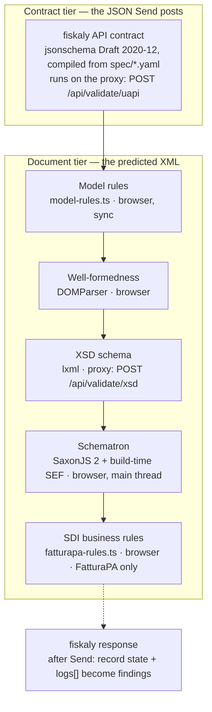

# 06 — Validation

Validation is a pipeline of six stages in two tiers. The tiers answer different questions and the
UI keeps them visually separate, because conflating them is the classic e-invoicing mistake:

- **The contract tier** — _will the fiskaly API accept the JSON I am about to post?_ This is the
  only stage about the payload Send actually transmits.
- **The document tier** — _is the XML this browser predicts fiskaly will generate valid by the
  format's own rules?_ A green run here is **not** fiskaly accepting anything; every stage note
  says so (`PREDICTED_DOCUMENT_NOTE`).



## The stages

| Stage                           | Engine & where                                                                                                                         | What it checks                                                                                                                                                                        | Notes                                                                                                                                                                                 |
| ------------------------------- | -------------------------------------------------------------------------------------------------------------------------------------- | ------------------------------------------------------------------------------------------------------------------------------------------------------------------------------------- | ------------------------------------------------------------------------------------------------------------------------------------------------------------------------------------- |
| fiskaly API contract            | `jsonschema` (Draft 2020-12) on the proxy, schema compiled from the active OpenAPI spec's `InvoiceTransaction`/`CorrectionTransaction` | The composed JSON — hand edits included — against what the API itself would reject                                                                                                    | Keyed on spec _content_, not country; runs first, and still runs when the XML writer fails (an unrelated writer limitation must not silence the one stage that predicts rejection)    |
| Model rules                     | `model-rules.ts`, browser, synchronous                                                                                                 | Arithmetic & consistency on the model: Σ lines = BT-106, breakdown partitions the lines, tax = taxable × rate ± 0.01, channel constraints                                             | The EN 16931 BR-CO calculation identities, enforced before any syntax exists                                                                                                          |
| Well-formedness                 | `DOMParser`, browser                                                                                                                   | Is the predicted XML parseable at all                                                                                                                                                 | A failure skips the remaining document stages (they would only echo it)                                                                                                               |
| XSD                             | `lxml` on the proxy (`POST /api/validate/xsd`)                                                                                         | Structure against the vendored schemas: UBL 2.1 Invoice (UBL/XRechnung), FatturaPA 1.2.x                                                                                              | CII has no vendored XSD — Schematron is its structural tier. Chosen over a WASM XSD engine; `xsd-client.ts` keeps the seam for a swap (ADR-0003)                                      |
| Schematron                      | SaxonJS 2 in the browser, executing **build-time-compiled SEF**                                                                        | The business rules the standards actually publish: CEN EN 16931 1.3.15 + Peppol BIS 3.0.20 (UBL), CEN + KoSIT XRechnung 2.5.0 (XRechnung), CEN CII (CII)                              | Never compiles `.sch` at runtime. Runs on the **main thread** — SaxonJS 2.7 cannot load in a Web Worker (ADR-0007); the parsed SEF is LRU-cached and runs are debounced + cancellable |
| SDI rules                       | `fatturapa-rules.ts`, browser, FatturaPA only                                                                                          | A curated set of Agenzia delle Entrate "elenco controlli" checks (00400/00401 Natura ↔ Aliquota, 00403, 00417, 00419, 00421–00425, 00426/00427, 00471…) with the published tolerances | SDI publishes no Schematron for FatturaPA, so these are hand-curated from specs 1.9.1                                                                                                 |
| _(after Send)_ fiskaly response | the record's `state` and `logs[]`                                                                                                      | What fiskaly/SDI actually said                                                                                                                                                        | ERROR/WARNING log lines become findings; SDI codes link back to the rule catalogue                                                                                                    |

## Findings

Every stage emits the same shape:

```ts
type Finding = {
  source;
  ruleId;
  severity: "fatal" | "error" | "warning" | "info";
  message;
  field?;
  xpath?;
  pointer?;
  line?;
  column?;
  bt?;
  test?;
};
```

Resolution is the point: a Schematron SVRL location (`svrl.ts` parses it, normalising both Saxon
location grammars) becomes a document path, the path index resolves it to a `FieldId`, and clicking
the finding highlights the field, the XML range and the JSON pointer at once
([05](05-mapper.md#selection--cross-highlighting)). The FindingsPanel filters by severity and
stage; `fatal + error` counts gate the Continue button's wording ("Send anyway"), never its
availability — the tool warns, the user decides.

## Mechanics worth knowing

- **Debounce and cancellation.** Runs are keyed on a digest of (invoice, xml, operation text) and
  debounced 250 ms behind the editors' own 400 ms. A superseded run is _aborted_ (an
  `AbortController` threads through the backend calls and stops between stages), not merely
  ignored.
- **Unavailability is a first-class status.** A stage that cannot run (backend down, SEF not
  built, writer failed) reports `unavailable` with the reason — visibly distinct from `passed`.
  The status line then says "not a clean bill of health".
- **Known engine defects are annotated, not hidden.** SaxonJS 2.7 evaluates `xs:integer mod` in
  IEEE-754 doubles, so the IBAN checksum rules (BR-DE-19 / DE-R-019) misfire on most real IBANs.
  `known-defects.ts` re-verifies the IBAN exactly (BigInt mod-97) and downgrades only
  provably-false findings to `info`, with a note saying why ([09](09-limitations.md#known-engine-defects)).
- **Rule-set provenance is visible.** Each Schematron run reports which rule sets and versions
  fired (`cen-ubl 1.3.15`, `peppol-ubl 3.0.20`, …), sourced from the SEF manifest that
  `make sef` writes ([08](08-infrastructure.md#schematron-sefs)).

## The running example

`it-b2b-sdi` validates clean: the contract stage passes against the `2026-06-01` spec, the model
identities hold (1500 + 500 + 800 = 2800 = BT-106), FatturaPA XSD accepts the FPR12 document, and
the SDI stage confirms Natura N3.5 pairs with `AliquotaIVA 0.00` (the 00400/00401 pairing checks). Switch the
format to UBL and the Schematron stage takes over the business rules — same invoice, CEN + Peppol
rule sets, and the _dichiarazione d'intento_ context survives only as an exemption reason, which is
precisely the kind of loss [09](09-limitations.md) catalogues.

Next: what happens when you press Send — [07 — Send & the backend](07-send-and-backend.md).
