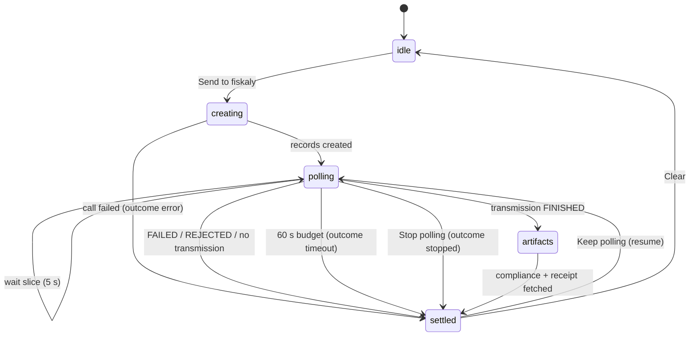

# 07 — Send & the backend

## What Send actually does

All e-invoicing on the UAPI is `POST /records` twice, then polling:

1. `POST /records` — an **INTENTION** (`operation.type: TRANSACTION`) opens the transaction.
2. `POST /records` — the **TRANSACTION::INVOICE**, carrying the composed JSON operation verbatim
   (`record.id` = the intention id).
3. Poll `GET /records/{transaction_id}` until `content.used_in.id` appears — the async worker has
   created an **E_INVOICE::TRANSMISSION** record.
4. Poll `GET /records/{transmission_id}` until `mode = FINISHED`.
5. Fetch the artifacts: `?compliance-artifact` (the transmitted XML → DiffView) and, in parallel,
   `?archive-artifact` (Italy's _Ricevuta di consegna_, shown as "Receipt of Transmission").

Timing is jurisdiction-shaped: Belgium usually finishes in seconds; Italy waits for SDI — minutes
routinely, up to 48 h by the spec. The UI is built around that asymmetry.

## The lifecycle state machine

`workflow.ts` models a send as a small machine the timeline visualises
(intention → transaction → transmission → artifacts nodes):

Outcomes are spelled honestly: `transmitted`, `rejected`, `failed`, `not-transmitted` (the record
completed but no transmission record was ever created — nothing left the building), `timeout` (the
60 s watch budget elapsed; SDI may simply be slow), `stopped` (you pressed Stop; the record keeps
processing regardless), `error`. `timeout` and `stopped` are resumable — **Keep polling** re-enters
the loop with the same record ids, and because those ids persist, that works across a page reload
too (an interrupted send restores as a resumable `stopped`).

Idempotency is deliberate: each send attempt holds one `X-Idempotency-Key`; a retry after a failed
call reuses it, so a response lost in transit replays the same records instead of double-invoicing.
The backend derives stable sub-keys per step (intention/transaction) from it.

### Corrections

A credit note (`typeCode 381`) needs the record id of the invoice it corrects. The app tracks
`correctionTarget` — the last **invoice** this browser transmitted (a transmitted correction never
becomes its own target), stored as a typed record `{id, presetId, country, mode, at}` and shown in
the preflight's "Corrects" row. Send routes the wrapped operation through
`POST /api/invoices/{id}/correction`, which builds the `TRANSACTION::CORRECTION` envelope
server-side and echoes `corrected_record_id`. Guard rails: no target yet → blocked with an
explanation; target from a different country or from the other MOCK/LIVE mode → blocked too (a
mock-minted record id must never be referenced in LIVE).

### Two transports

Send prefers the typed backend choreography (`POST /api/invoices` → `/wait` → `/artifact`). If the
backend has no system id configured for the country (a clean MOCK clone), it falls back to driving
the same choreography **directly through the `/api/uapi` passthrough** with a placeholder system id
— flagged in the UI as mock-only. Both transports produce identical record semantics; the fallback
is why the demo works with zero configuration.

## The backend, module by module

The proxy exists because the browser must never hold credentials (and because
`test.api.fiskaly.com` serves no CORS headers). Its contract is the `/api/*` surface listed in
[ARCHITECTURE.md](../ARCHITECTURE.md#frontend--backend-contract); the mechanics:

- **`uapi.py` — `UapiClient`**, one per persona on one `httpx.AsyncClient`: caches the bearer token
  keyed on `expires_at` (refreshes 60 s early, under a lock), retries exactly once on 401, injects
  `X-Api-Version` and an `X-Idempotency-Key` on every POST/PATCH, and passes **every** call through
  the recorder. A token failure surfaces as the fiskaly status + body (never a bare 500), naming
  `POST /tokens` as the failing call.
- **`workflow.py`** — the typed choreography above. `/wait` slices are long-polls (the frontend
  asks for 5 s slices); once the transmission id is known the backend skips the transaction read
  (half the poll traffic on a slow SDI run), the timeout is clamped server-side, and a slice ends
  early when the client disconnects.
- **`recorder.py` + `mask.py`** — a ring buffer of `CallRecord`s (method, url, masked headers and
  bodies, duration, a copy-paste cURL with the token placeholdered) streamed to the browser as SSE
  (`/api/events`). Reconnects replay via `Last-Event-ID`; an id from before a backend restart is
  detected and the buffer replays from the start. Masking is centralised: secrets, bearer tokens,
  the taxpayer `tax_id_number`, and multi-kB base64 payloads all collapse before anything is stored.
- **`session.py` + `settings.py`** — `.env` under runtime overrides. Credentials can be pasted in
  the Settings dialog and live in backend memory only, returned as a fingerprint, never echoed
  (ADR-0005). LIVE mode is gated on the **seller** credentials only.
- **`routes.py`** — the contract, plus a catch-all `/api/uapi/{path}` passthrough (persona via
  `X-Persona`) that the Test runner and the direct transport use. UAPI bodies are pass-through
  dicts; the proxy never re-models fiskaly's schemas.
- **`onboarding.py`** — the per-persona account tree (organizations → subjects → taxpayers →
  systems, fetched in parallel, pagination followed) and guided provisioning behind an explicit
  confirmation, feeding the EntityTree in Setup.
- **`collections.py`** — parses the published fiskaly Postman collections into runnable steps for
  the Test runner: transmission folders run, account-mutating and reception steps are skipped with
  a stated reason, and known defects in the published collections are surfaced as notes rather
  than silently fixed.

## The mock

MOCK mode is not a separate code path — it is an `httpx.MockTransport` handed to the same
`UapiClient` (`mock.py`). It replays committed fixtures (`backend/fixtures/uapi/`) and runs a small
deterministic state machine so the lifecycle _feels_ real:

- a transaction gains `used_in` on its **2nd** read; a transmission reaches `FINISHED` on its
  **3rd** — so the timeline genuinely polls;
- `document.number` starting **`FAIL-`** → the transmission ends `FAILED` with the real SDI log
  `00471 Cessionario uguale al cedente`;
- a recipient without an `invoicing` block → `COMPLETED` with an ERROR log and **no transmission**
  (the `not-transmitted` outcome);
- artifacts are fixture XMLs personalised with the sent invoice's number and total — which is why
  the MOCK diff carries its caveat ([09](09-limitations.md#the-mock-diff-caveat));
- idempotency replays honour `X-Idempotency-Key` and answer with `X-Idempotency-Replayed: true`,
  and unknown routes fail loudly with the fixture filename they expected.

Everything above the transport — client, recorder, routes, frontend — cannot tell the difference.
That is the point: the demo exercises the _real_ integration code.

Next: how the specs, standards and images are built — [08 — Infrastructure](08-infrastructure.md).
